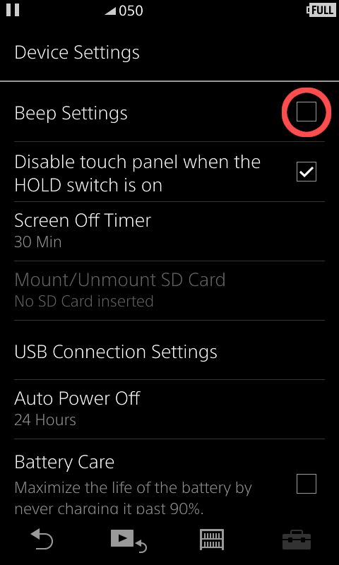

nw-scrob
========

Scrobbler for Linux-based NW-A50 Series WALKMAN® portable players.

Supported models: NW-A50Series.

Might work for WM1A/WM1Z, ZX300, NW-A40/A30.

Creates `.scrobbler.log` on internal storage.

[Alternative implementation ideas](./HOW.md)


### Requirements
  - make
  - Go >= 1.22.1

### Build

```shell
make build
```

### Release

```shell
git submodule update --recursive --init
make release
```

Grab Windows installer/UPG files from `nw-installer/installer/{windows/stock/walkmanOne}` directories.

### Installation

See [INSTALL.md](INSTALL.md)

### Usage
Before you start, `Device Settings -> Beep Settings` option __must__ be turned off:



Why? Beeps are inserted in play queue as regular tracks; it resets currently played track.

After that just play some tracks and check for `.scrobbler.log` in root directory on your device.

### Misc

[Possible approaches](HOW.md)

